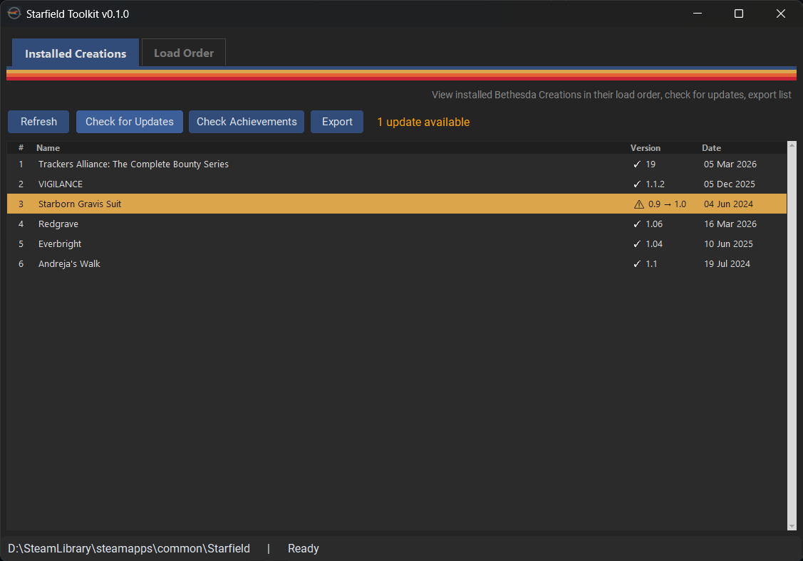
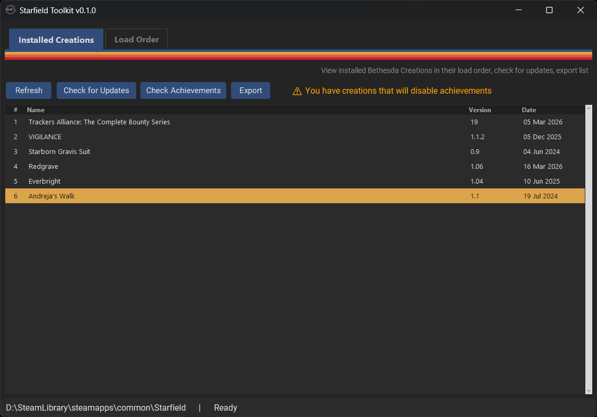
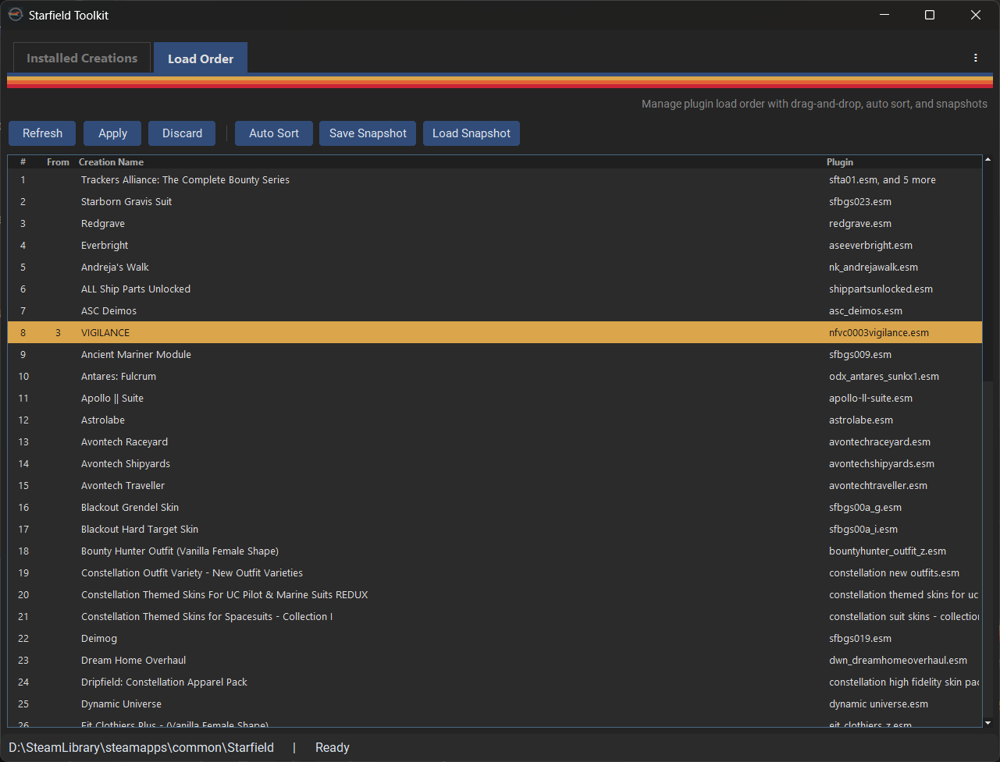
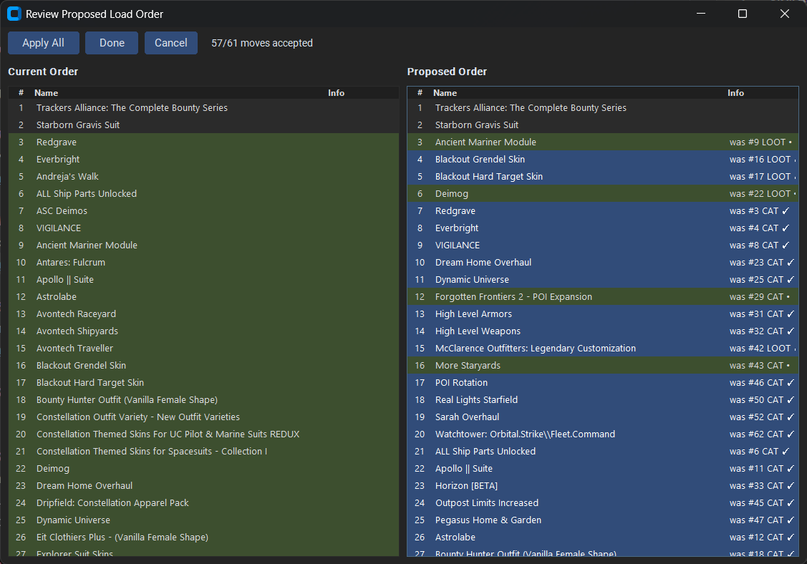

<p align="center">
  
</p>
<h1 align="center">Starfield Toolkit</h1>

> **This tool is designed for Bethesda Creations only.**
> If you use Nexus Mods with a mod manager like Vortex or MO2, those tools already provide load order management, update checking, and more. This project is not intended to replace them.

Starfield Toolkit is a lightweight Windows GUI to help managing official Bethesda Creations content in Starfield.

The sole reason for its existence is that some operations are frustratingly non-user-friendly in-game and on the site, e.g. you have no other way to check for pending updates than walking through all creations in your library one by one.
This toolbox tries to provide solutions to issues like this without messing with the game itself.

# Download

Grab the latest `StarfieldToolkit.exe` from [Releases](https://github.com/MightyOwl4/starfield-toolkit/releases/latest).

> **Downloading executables from unknown people is generally a bad idea!**
>
> Here, I warned you! :D The EXE file is automatically built by GitHub based on the (public) code in the repo, so unless someone hacks ME and compromises the repo, you should be safe. But ... :D

If you prefer to install and compile yourself - look below

# Tools

## Installed Creations

View all installed Bethesda Creations in their current load order. Features:

### Check for Updates
compares your installed versions against the Bethesda Creations API and highlights outdated entries




### Check Achievements
flags any creations that will disable achievements when active



### Export
save your creation list as a markdown table or CSV, for sharing online

### Auto-refresh
watches your Plugins.txt and ContentCatalog.txt for changes and prompts you to reload


## Load Order

Manage your plugin load order with safety and confidence.

### Drag-and-Drop Reordering
Rearrange creations manually — changes are staged (highlighted) until you explicitly apply them. Plugins.txt is never written by accident.



### Auto Sort
One-click sorting using a priority-based pipeline: category-based rules (11-tier community system) combined with LOOT masterlist data. When sorters disagree, the more authoritative source wins.

### Review & Approve
Git-merge-style diff view showing current vs proposed order side-by-side. Each moved item shows where it came from and which sorter decided the move (LOOT, CAT). Accept or ignore individual moves before applying.



### Snapshots
Save and restore named load order configurations. Useful for switching between setups (e.g., achievement-friendly vs full mods) or as a backup before experimenting.

### Safety Features
- Starfield process detection — apply is blocked while the game is running
- Multi-file creations (e.g., Trackers Alliance) are grouped and sorted as a pack
- Bethesda official creations are always kept at the top

# Project setup

You need Python 3.12+ and uv installed
```bash
# Clone the repository
git clone <repo-url>
cd starfield-tool

# Install dependencies
uv sync

# Run the application
uv run python -m starfield_tool
```

# Building

```
make build
```

Produces `build/dist/StarfieldToolkit.exe` via PyInstaller.


# Credits & Acknowledgments

This project builds on the work of the Starfield modding community. Special thanks to:

- **[LOOT](https://loot.github.io/)** — Load Order Optimisation Tool. The Starfield masterlist is used directly for sorting rules and plugin metadata.
- **[hst12/Starfield-Creations-Mod-Manager-and-Catalog-Fixer](https://github.com/hst12/Starfield-Creations-Mod-Manager-and-Catalog-Fixer)** — Research reference for ContentCatalog and Plugins.txt handling.
- **[monster-cookie/starfield-modding-notes](https://github.com/monster-cookie/starfield-modding-notes)** — Community documentation on load order tiers and plugin types.
- **[Ortham's Load Order in Starfield](https://blog.ortham.net/posts/2024-06-28-load-order-in-starfield/)** — Detailed technical writeup on how Starfield's load order works.
- **[\[XSX\] Starfield Load Orders](https://docs.google.com/spreadsheets/d/1WmuMojgCHmYzgFCVAafFA2Mxs43kcwkhN_BgagBXuRk/)** — Community spreadsheet with the 11-tier category system used for auto sorting.
- **[Bethesda Creations](https://creations.bethesda.net/)** — The platform whose (undocumented) API powers the update and achievement checks.

# AI usage disclosure

## App logo

Logo is produced by Midjourney, using the following prompt:

> Minimalist app icon design, a mechanic wrench lying horizontally centered inside a thin white circular ring with a small gaps at left and right side (Starfield logo circle style), the wrench handle and left half of the head painted with vintage retro racing stripes in red orange yellow blue and cyan running along its length, right side plain brushed metal, solid dark space navy background, clean vector icon style, no gradients, square format
>
This project has no budget to commission an artist, however anyone willing to contribute a decent human-made one is more than welcome.


## Code

Produced mostly by Anthropic's Opus 4.6, using spec-driven development approach, and passing code review to ensure there are no (major) flops.

# License

See [LICENSE](LICENSE) for details (but It's MIT, so why bother)
